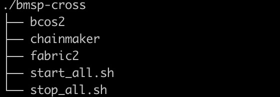

# 1. 前提说明

当前部署的 `bmsp-cross` 的服务目录结构如下：



目前跨链服务支持飞梭链、长安链和fabric2.0链


# 2. 部署现有链插件

以更新长安链为例说明。

1. 将编译的长安链插件拷贝至 `bmsp-cross/chainmaker/plugin` 目录下，使用下面的命令重新启动 `bmsp-cross` 服务。

```bash
$ docker compose stop bmsp-cross
$ docker compose up -d bmsp-cross
```

2. 进入数据可信服务系统，依次选择多链管理->链接入管理。点击接入区块链按钮
3. 选择链类型长安链-国密
4. 填写链名称，比如chainmaker_qchain
5. 链ID，需要和部署的链id保持一致，比如 qchain
6. 组织ID，需要和连接节点的组织id保持一致，比如digital
7. 上传组织证书
8. 填写连接节点的地址，比如127.0.0.1:12301
9. 输入用户ID，比如onehaha
10. 输入用户名称，比如admin
11. 上传签名证书、签名私钥、TLS证书和TLS私钥

# 3. 接入全新的链插件

如果开发的链插件不是飞梭链、长安链和fabric2.0链。

在开发的过程中，如果要支持国密版本的话，有很大的可能引用的 jar 和现有的 bcos、chainmaker链插件的 jar 有冲突。

下面分为有冲突和没有冲突的两种情况说明链插件的部署。

## 3.1 无冲突

1. 按照规范开发编译链插件，比如编译好的链插件名称为：`eth-gm-plugin.jar`

2. 将 `eth-gm-plugin.jar` 包拷贝至 `fabirc2/plugin` 目录下（或`bcos2/plugin｜chainmaker/plugin`）

3. 重新启动 `bmsp-cross` 服务

4. 进入数据可信服务系统，依次选择系统管理->字典管理，点击字典类型为 `sys_chain_stub_type` 的标签

5. 点击增加按钮，增加插件类型

   数据标签：比如以太坊链

   数据键值：gm-eth

   显示排序：2

6. 进入 `nacos` 配置中心（http://localhost:8848/nacos）

7. 选择配置列表->prod，点击编辑`application-common.yml`，增加一下配置

   ```yam
   # 如果2步骤中将插件拷贝至 fabirc2/plugin 目录下
   wecross-router:
     servers:
       gm-eth: "bmsp-cross:8251"
       
   # 如果2步骤中将插件拷贝至 chainmaker/plugin 目录下
   wecross-router:
     servers:
       gm-eth: "bmsp-cross:8250"
       
   # 如果2步骤中将插件拷贝至 bcos2/plugin 目录下
   wecross-router:
     servers:
       gm-eth: "bmsp-cross:8252"
   ```

8. 进入数据可信服务系统，依次选择多链管理->链接入管理。点击接入区块链按钮

9. 链类型选择以太坊链，以及添加以太坊链配置信息

## 3.2 有冲突

1. 按照规范开发编译链插件，比如编译好的链插件名称为：`eth-gm-plugin.jar`

2. 在 `bmsp-cross` 目录下创建一个新目录，比如 `eth-chain`

3. 将 `bmsp-cross/chainmaker` 相关目录拷贝至 `eth-chain` 目录下

   ```bash
   $ cp -r bmsp-cross/chainmaker/apps ./eth-chain
   $ cp -r bmsp-cross/chainmaker/lib ./eth-chain/
   $ cp -r bmsp-cross/chainmaker/conf ./eth-chain/ # 不包括 bmsp-cross/chainmaker/conf/chains 目录下的所有文件和目录
   $ mkdir -p ./eth-chain/plugin
   ```

4. 将 `eth-gm-plugin.jar` 拷贝至 `./eth-chain/plugin` 目录

5. 编辑 `./eth-chain/conf/wecross.toml` 配置文件，将 `rpc.port` 和 `p2p.listenPort` 分别更改为没有被系统占用的端口，比如 `8253` 和 `25503`

6. 编辑 `docker-compose.yaml` 文件，增加下面的配置：

   ```
     bmsp-cross:
       image: openjdk:8u342-jre
       container_name: bmsp-cross
       environment:
         # 时区上海
         TZ: Asia/Shanghai
         LANG: zh_CN.utf8
       ports:
         - "8253:8253"
         - "25503:25503"
       volumes:
         # 配置文件
         - ./bmsp-cross/eth-chain:/wecross-router/eth-chain

7. 重启 `bmsp-cross` 服务

8. 进入数据可信服务系统，依次选择系统管理->字典管理，点击字典类型为 `sys_chain_stub_type` 的标签

9. 点击增加按钮，增加插件类型

   数据标签：比如以太坊链

   数据键值：gm-eth

   显示排序：2

10. 进入 `nacos` 配置中心（http://localhost:8848/nacos）

11. 选择配置列表->prod，点击编辑`application-common.yml`，增加一下配置

```yaml
wecross-router:
  servers:
    gm-eth: "bmsp-cross:8253"
```

12. 进入数据可信服务系统，依次选择多链管理->链接入管理。点击接入区块链按钮

13. 链类型选择以太坊链，以及添加以太坊链配置信息